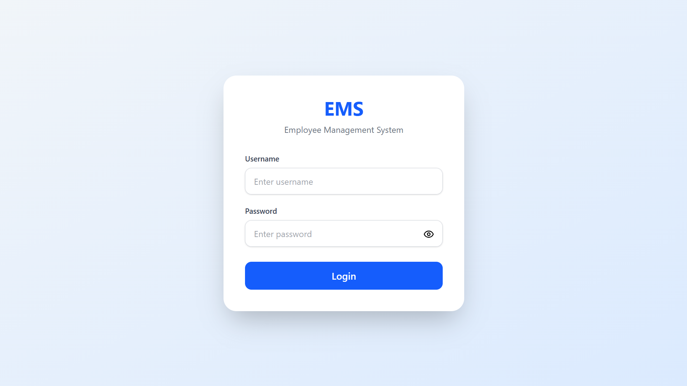
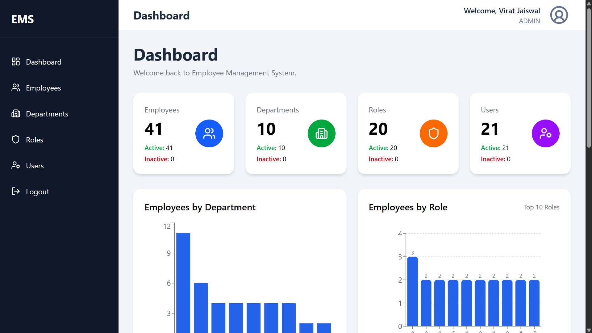
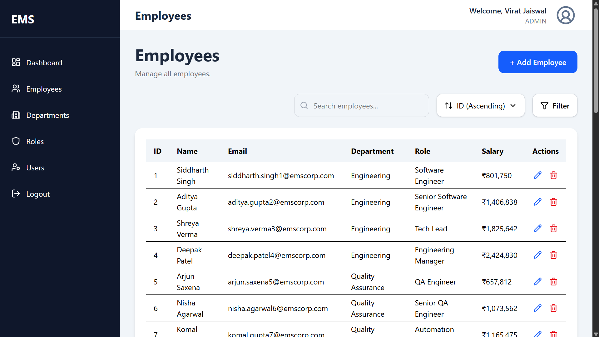
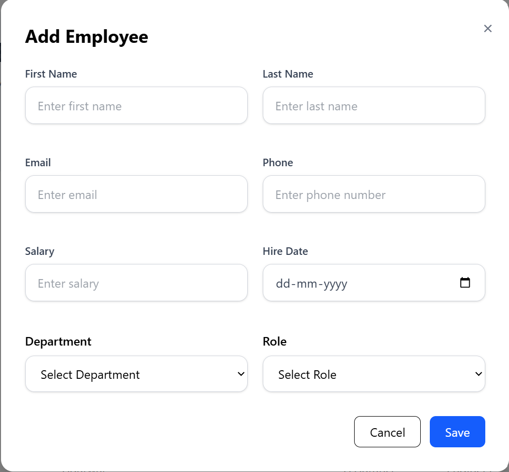
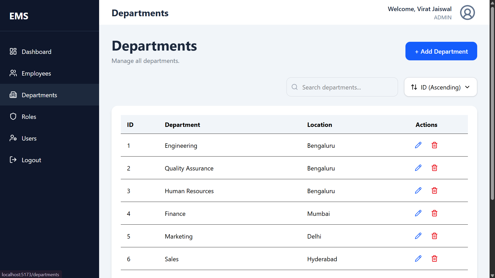
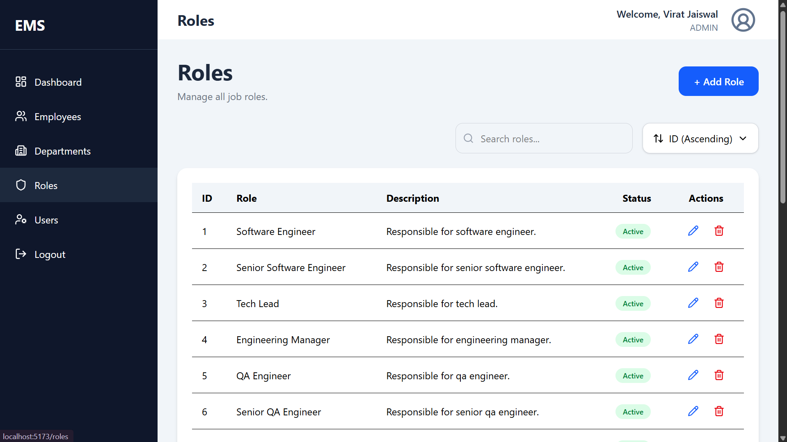
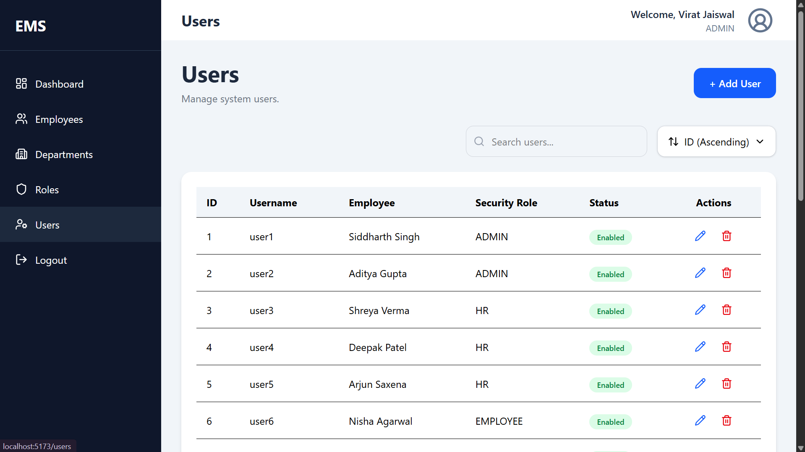
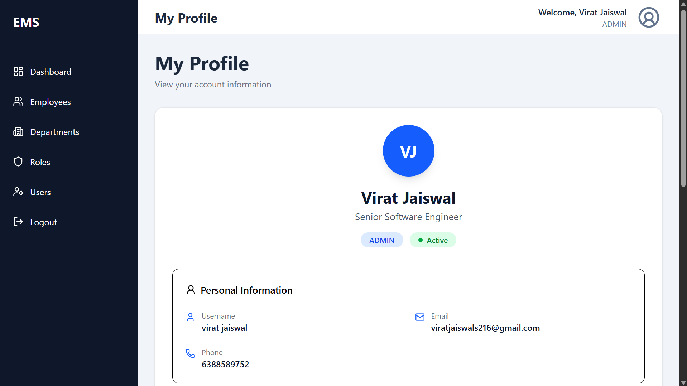

# Employee Management System

A **production-inspired Full Stack Employee Management System** built using **Java, Spring Boot, Spring Security, JWT, PostgreSQL, React, TypeScript, and Tailwind CSS** following enterprise-level architecture and clean coding principles.

The project demonstrates secure authentication, role-based authorization, reusable frontend components, scalable backend architecture, and modern software engineering practices commonly used in enterprise applications.

---

## Features

### Authentication & Security

* JWT-based Authentication
* Role-Based Authorization (RBAC)
* Secure Password Encryption
* Protected REST APIs
* Spring Security Integration

### Employee Management

* Create, Update, Delete Employees
* Employee Search
* Pagination
* Sorting
* Advanced Filtering
* Department Assignment
* Role Assignment

### Department Management

* Create, Update, Delete Departments
* Search Departments
* Pagination
* Sorting
* Validation for Duplicate Departments

### Role Management

* Create, Update, Delete Roles
* Search & Sorting
* Role Assignment

### User Management

* User CRUD Operations
* Enable/Disable Users
* Role Assignment
* Employee Linking

### Dashboard

* Business Statistics
* Employee Overview
* Quick Insights

### Audit Logs

* Track System Activities
* User Action History

---

# Tech Stack

## Backend

* Java 21
* Spring Boot
* Spring Security
* Spring Data JPA
* JWT Authentication
* MapStruct
* Lombok
* Bean Validation
* PostgreSQL
* Maven

## Frontend

* React
* TypeScript
* Vite
* Tailwind CSS
* TanStack Query (React Query)
* Axios
* React Router DOM
* Lucide React

---

# Project Architecture

```text
React Frontend
        │
 REST APIs (HTTP)
        │
Spring Boot Backend
        │
 Service Layer
        │
 Repository Layer
        │
 PostgreSQL Database
```

---

# Project Structure

```
employee-management-system
│
├── backend
│   ├── config
│   ├── controller
│   ├── dto
│   ├── entity
│   ├── exception
│   ├── mapper
│   ├── repository
│   ├── security
│   ├── service
│   └── util
│
├── frontend
│   ├── assets
│   ├── components
│   ├── features
│   ├── hooks
│   ├── layouts
│   ├── pages
│   ├── services
│   ├── types
│   └── utils
│
└── README.md
```

---

# Key Features

* Enterprise Layered Architecture
* DTO Pattern
* MapStruct Mapping
* Bean Validation
* Global Exception Handling
* JWT Authentication
* Role-Based Authorization
* Feature-Based Frontend Architecture
* Reusable Components
* Reusable Dialogs
* Pagination
* Searching
* Sorting
* Advanced Filtering
* Responsive UI
* Clean Code Practices

---

# 📸 Application Screenshots

## Authentication

### Login



---

## Dashboard



---

## Employee Management

### Employee List



### Create Employee



---

## Department Management



---

## Role Management



---

## User Management



---

## User Profile



# Database

PostgreSQL is used as the relational database.

Main Entities:

* Employee
* Department
* Role
* User
* Audit Log

Relationships:

* One Department → Many Employees
* One Role → Many Users
* One Employee → One User

---

# REST API Modules

| Module         | Status |
| -------------- | ------ |
| Authentication | ✅      |
| Employees      | ✅      |
| Departments    | ✅      |
| Roles          | ✅      |
| Users          | ✅      |
| Dashboard      | ✅      |
| Audit Logs     | ✅      |

---

# Getting Started

## Clone Repository

```bash
git clone https://github.com/virat216/employee-management-system.git
```

---

## Backend

```bash
cd backend
mvn clean install
mvn spring-boot:run
```

Backend runs on:

```
http://localhost:8080
```

---

## Frontend

```bash
cd frontend
npm install
npm run dev
```

Frontend runs on:

```
http://localhost:5173
```

---

# Environment Variables

Backend (`application.properties`)

```properties
spring.datasource.url=YOUR_DATABASE_URL
spring.datasource.username=YOUR_DATABASE_USERNAME
spring.datasource.password=YOUR_DATABASE_PASSWORD

jwt.secret=YOUR_SECRET_KEY
jwt.expiration=86400000
```

---

# Future Improvements

* Docker Support
* Docker Compose
* Swagger / OpenAPI Documentation
* CI/CD Pipeline
* Unit Testing
* Integration Testing
* Email Notifications
* Excel Export
* PDF Export

---

# Author

**Virat Jaiswal**

* GitHub: https://github.com/virat216
* LinkedIn: https://www.linkedin.com/in/viratjaiswal216/
